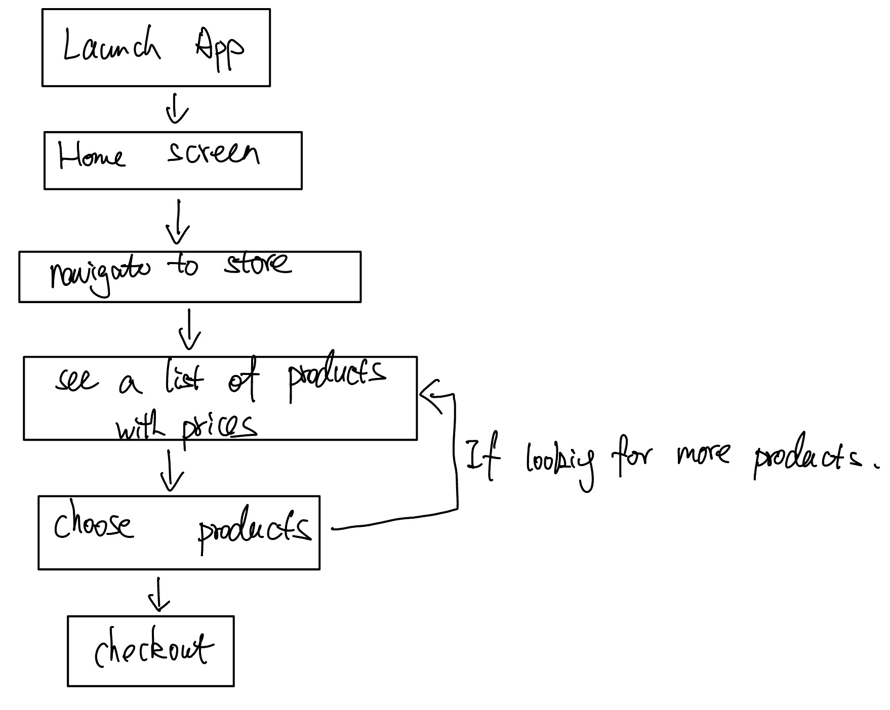

# Specification Phase Exercise

A little exercise to get started with the specification phase of the software development lifecycle. See the [instructions](instructions.md) for more detail.

## Team members
Tim Yan https://github.com/T1mmmmm
Warren Wu https://github.com/W0rren12

## Stakeholders
Harry Yu:
-Need basic bartending knowledge for self-study
-Zero or low fee cost
-Shipping could be dangerous for alcohol bottles

## Product Vision Statement
Our goal is to inspire and empower bartenders of all levels by providing a platform with expert tutorials, creative recipes, and a marketplace for premium spirits.

## User Requirements
1. As a drink lover, I want a platform with a variety of drink recipes so that I can learn and experiment with new cocktails.
2. As a drink lover, I want to discuss techniques and share tips so that I can gain insights from fellow enthusiasts without expensive classes.
3. As a budget-conscious learner, I want affordable access to professional bartending techniques so that I can improve my skills without breaking the bank.
4. As an aspiring home bartender, I want step-by-step tutorials so that I can confidently prepare drinks for my friends and family.
5. As a curious mixologist, I want expert-curated content so that I can continuously refine and expand my craft.
6. As a professional bartender, I want to contribute my own recipes and tips so that I can share my expertise with the community.
7. As a beginner, I want interactive lessons that break down the basics of bartending so that I can quickly learn essential skills.
8. As a social enthusiast, I want the ability to rate and review recipes so that I can help others identify the best drinks to try.
9. As a convenience-seeker, I want integrated alcohol purchasing options so that I can easily buy premium spirits and ingredients directly through the app.
10. As a community organizer, I want to host and join virtual tasting events so that I can connect with fellow drink lovers and learn collaboratively.
11. As a drink lover, I want personalized drink recommendations based on my taste and past activity so that I can quickly discover new recipes that suit my preferences.
12. As a busy user, I want the ability to save my favorite recipes and generate shopping lists so that I can easily prepare for my next cocktail night.

## Activity Diagrams
UML diagrams:

## Clickable Prototype
https://www.figma.com/proto/90FN4zLkyIlpJ8ri1i568P/awesome-team-(Community)?node-id=1-2&p=f&t=BLHn6qfwCg37e4Xc-0&scaling=scale-down&content-scaling=fixed&page-id=0%3A1&starting-point-node-id=1%3A2&show-proto-sidebar=1